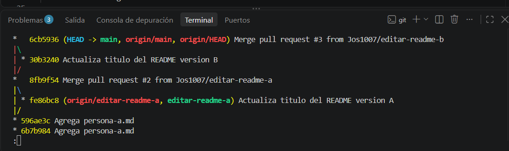
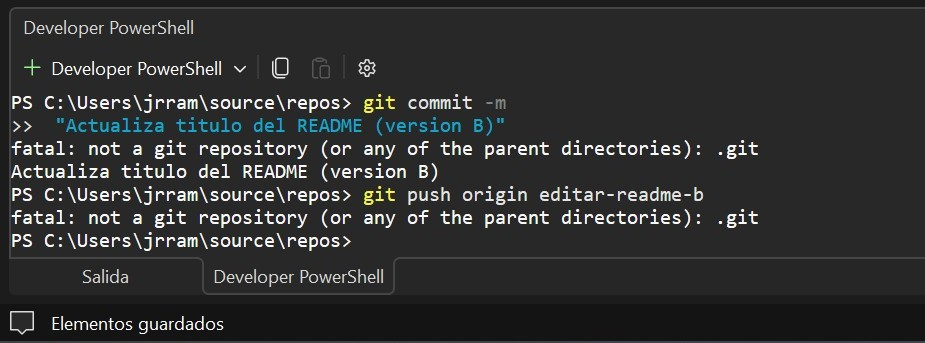

# Bitácora de Trabajo y Respuestas de la Práctica

## 1. Preguntas Técnicas de la Práctica

### ¿Qué diferencia hay entre clonar un repositorio y descargarlo como ZIP?
Clonar un repositorio (git clone) descarga todos los archivos junto con todo el historial de commits, ramas y la configuración de Git (.git), lo que permite rastrear cambios, crear ramas y sincronizar datos con GitHub. Descargar un ZIP solo baja una foto estática de los archivos en ese momento, sin historial ni integración con comandos de Git.

### Pregunta sobre el comando git branch (Ejercicio 3.1)
Al ejecutar git branch, localmente solo se observan las ramas creadas o descargadas en esa máquina. No se ven las ramas creadas por el otro integrante en remoto hasta ejecutar git fetch o git pull, lo cual actualiza las referencias del servidor.

### ¿Por qué Git no puede decidir por sí solo cómo resolver un conflicto al editar la misma línea?
Git puede resolver fusiones automáticamente cuando los cambios ocurren en distintas líneas o archivos porque no hay contradicciones. Sin embargo, cuando dos personas modifican exactamente la misma línea, Git no sabe cuál versión es la correcta o prioritaria según la lógica del negocio/código, por lo que exige que un ser humano tome la decisión manual.

---

## 2. Capturas de Pantalla (git log --oneline --graph --all)
### Captura de Persona A

### Captura de Persona B

---

## 3. Reflexión Final (Parte 7)

1. *¿Qué hubiera pasado si ambos hubieran trabajado directamente sobre main en lugar de usar ramas separadas?*
   Habríamos tenido sobrescrituras constantes de código, errores al hacer push por cambios no sincronizados y un historial desordenado con alto riesgo de perder trabajo al intentar corregir errores.

2. *¿Qué ventaja ofrece revisar el Pull Request de otra persona antes de fusionarlo, en comparación con fusionar directamente sin revisión?*
   Permite validar la calidad del código, detectar errores de sintaxis o lógica antes de que afecten la rama principal productiva, mantener un estándar de equipo y asegurar que la integración no rompa nada.

3. *¿En qué momento de la práctica hubiera sido más difícil (o imposible) trabajar en equipo si solo hubieran usado una carpeta compartida sin Git?*
   En el momento de la Parte 5 al intentar modificar el archivo README.md simultáneamente. Sin Git, uno habría sobrescrito por completo los cambios del otro sin dejar rastro del trabajo previo ni opción de recuperar el texto anterior.

4. *Ventajas y desventaja de trabajar con ramas y Pull Requests en un proyecto real:*
   * *Ventaja 1:* Aislamiento total del entorno de desarrollo; se pueden probar funciones nuevas sin romper la versión estable en main.
   * *Ventaja 2:* Control de calidad y trazabilidad mediante revisiones de código cruzadas (code reviews).
   * *Desventaja:* Requiere mayor tiempo de gestión operativa (creación de ramas, apertura de PRs, resolución de conflictos y coordinación entre miembros).